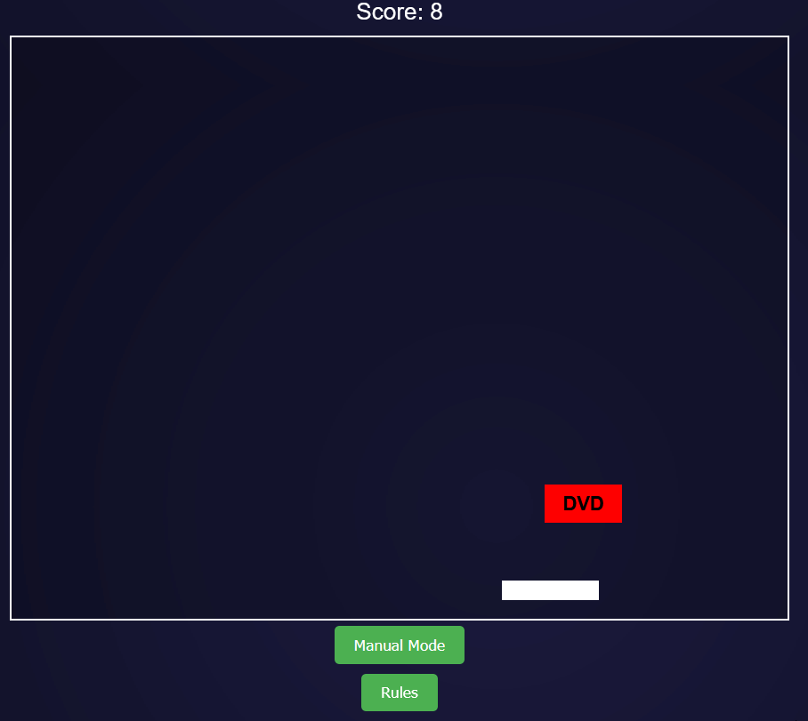

# 🎾 DVD Pong Grok 💿  

A **nostalgic twist on Pong**, where you bounce a **DVD logo**, chase **corner hits for bonus points**, and witness a **theatrical curtain finale**! Optimized for PC  

  

## 🕹️ How to Play  
🎮 **Manual Mode**: Move the paddle with your **mouse** to bounce the DVD logo.  
🤖 **Robot Mode**: Click **"Robot Mode"** to let the paddle play **automatically** (toggle back anytime).  
🏆 **Scoring System**:  
   - 🎯 **1 point** per paddle hit.  
   - 🎆 **100 points + confetti** for hitting a **corner (within 5 pixels)**.  
   - 🚫 **Game Over**: The game ends if the **DVD hits the bottom** (unless it's a corner hit).  

## 📜 Rules  
- 🏓 Move the paddle with your **mouse** (**Manual Mode**).  
- 🔢 Earn **1 point per paddle hit**.  
- 🎯 **Hit a corner for 100 points & confetti!**  
- 🚫 The game **ends if the DVD hits the bottom**.  
- 🎭 **Curtains close on Game Over—restart to play again!**  

⚠ **Warning**: Intense visual effects at higher levels may trigger **photosensitivity** in some players.  

## 🖥️ Play Locally with VS Code  
Want to play it **locally**? Follow these steps:  
1️⃣ **Download** `DVDPong.html` from this repo.  
2️⃣ **Install** [VS Code](https://code.visualstudio.com/).  
3️⃣ **Open VS Code**, drag `DVDPong.html` into it.  
4️⃣ **Install** the **"Live Server"** extension (by Ritwick Dey).  
5️⃣ **Right-click** the file → **"Open with Live Server"**.  
6️⃣ Your **browser opens automatically—start playing!**  

---

## Credits
- Built with Grok 3 (xAI) 
- [eudk](https://github.com/eudk)   
- Feel free to submit pull requests and improve it!

### Tags for Discovery  
`#gamedev` `#retro` `#nostalgia` `#javascript` `#html5game` `#indiegames`  `#grok` `#grok3` `#xai`   